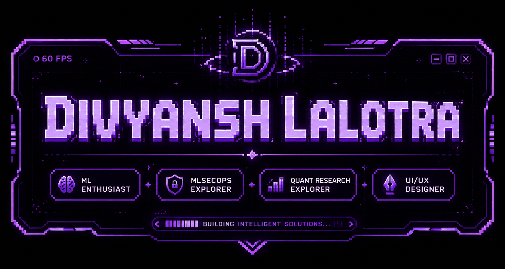

  

  
  
  

  

::: {align="center"}
# 👋 Hey, I'm Divyansh Lalotra

### `Building secure AI systems • Exploring Quantitative Finance • Crafting impactful products`

``{=html}
``{=html}
``{=html}
:::

------------------------------------------------------------------------

## 🚀 About Me

-   🎓 **B.E. in Computer Science and Business Systems**
    -   Thapar Institute of Engineering & Technology (2025--2029)
-   📊 **CGPA:** 8.60 / 10.00
-   🏆 **Google Big Code 2026:** Top 1500 (Round 2)
-   🧠 Interests:
    -   Machine Learning Security
    -   Artificial Intelligence & Machine Learning
    -   Quantitative Finance
    -   UI/UX Design
-   🌱 Currently Learning: **MLSecOps**
-   🔭 Working on:
    -   Authentication Systems
    -   Volatility Forecasting Models

------------------------------------------------------------------------

## 💻 Tech Stack

Languages      → Python • Java • C/C++ • SQL
AI / ML        → Scikit-Learn • TensorFlow • PyTorch • NLP
MLOps          → MLflow • Model Deployment • Experiment Tracking
Finance        → Volatility Forecasting • HAR Models • Sentiment Analysis
Backend        → Flask • APIs • Authentication Systems
Tools          → Git • GitHub • VS Code • Jupyter

## 🌟 Featured Projects

### 📈 HAR + Sentiment Volatility Forecasting

-   Built a financial forecasting pipeline integrating HAR models with
    sentiment analysis.
-   Explored forward testing, evaluation metrics, and volatility
    prediction.
-   Worked with research-oriented methodologies used in quantitative
    finance.

### 🛡️ SHIELD

-   Security-focused project integrating AI workflows with robust
    engineering practices.
-   Focused on reliable deployment and practical MLOps principles.

### 🔐 Authentication Systems

-   Developing secure authentication workflows emphasizing usability and
    scalability.

------------------------------------------------------------------------

## 📚 Current Focus

Research Areas:
  - Machine Learning Security
  - Financial Machine Learning
  - MLOps & MLSecOps
  - AI System Reliability

Goals:
  - Contribute to impactful AI projects
  - Build production-grade ML systems
  - Explore quantitative engineering opportunities

------------------------------------------------------------------------

## 📊 GitHub Stats

> Replace the placeholders below with your generated GitHub stat cards.

------------------------------------------------------------------------

::: {align="center"}
### ✨ "Code with purpose. Learn relentlessly. Build fearlessly."

**GitHub:** `@nej1gotnochill`
:::

## 🌐 Connect With Me
- LinkedIn: https://www.linkedin.com/in/divyansh-lalotra-89145137a/
- GitHub: https://github.com/nej1gotnochill
- LeetCode: https://leetcode.com/u/nej1gotnochill/

  

