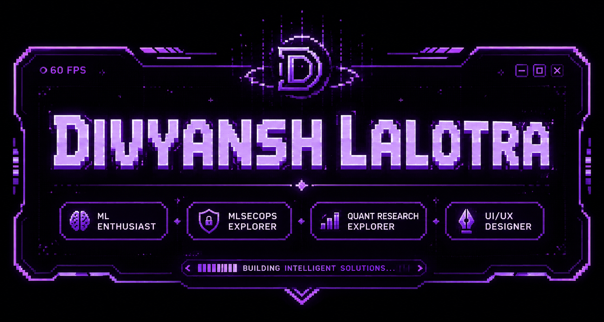
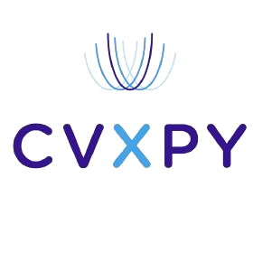
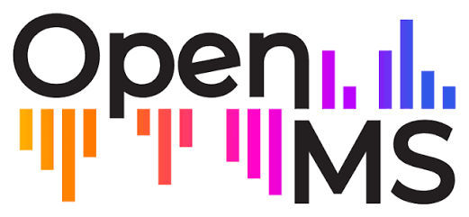

  

<table>
<tr>
<td><b>Convex Optimization Engineer.</b> Building mathematical software that measurably runs faster.</td>
<td><a href="https://www.linkedin.com/in/divyansh-lalotra-89145137a/">LinkedIn</a> · <a href="https://github.com/nej1gotnochill">GitHub</a> · <a href="https://leetcode.com/u/nej1gotnochill/">LeetCode</a></td>
</tr>
</table>

I work where mathematical software meets the machine — canonicalization pipelines, solver interfaces, and the benchmarking infrastructure that tells maintainers whether a change actually made things faster.

## Open Source, Engineering & Programs

- **[cvxpy](https://github.com/cvxpy/cvxpy)** [Open Source Developer](https://github.com/cvxpy/cvxpy/pulls?q=is%3Apr+author%3Anej1gotnochill) — added dual variables to `ConstantSolver` for feasible constant problems ([#3505](https://github.com/cvxpy/cvxpy/pull/3505), merged) and isolated OR-Tools tests from HiGHS to prevent native symbol conflicts ([#3508](https://github.com/cvxpy/cvxpy/pull/3508), merged)
- **[cvxpy](https://github.com/cvxpy/cvxpy)** [Tuple-Axis Norms](https://github.com/cvxpy/cvxpy/pull/3539) — tuple-axis support in `norm()` plus an N-D `p=2` SOC canonicalization fix, including a per-fiber coordinate-mapping bug that `keepdims=True` exposed while value-level assertions stayed tautological ([#3539](https://github.com/cvxpy/cvxpy/pull/3539))
- **[OpenMS](https://github.com/OpenMS/OpenMS)** [Open Source Developer](https://github.com/OpenMS/OpenMS/pulls?q=is%3Apr+author%3Anej1gotnochill) — built the project's first benchmarking layer for [Issue #8788](https://github.com/OpenMS/OpenMS/issues/8788): a gated `ENABLE_BENCHMARK_TESTING` CMake option, benchmark test directory, and CTest registration ([#9839](https://github.com/OpenMS/OpenMS/pull/9839))
- **[OpenMS-benchmarking](https://github.com/OpenMS/OpenMS-benchmarking)** [Benchmarking Infrastructure](https://github.com/OpenMS/OpenMS-benchmarking) — CI that builds OpenMS from a pinned SHA, runs DDA and OpenSwath DIA benchmarks, and reports wall time, CPU time, and peak RSS against a stored baseline. Contributed the v2 results schema with automatic v1 promotion, the benchmark-agnostic report renderer, the OpenSwath DIA benchmark and real comparison baseline, package-mode runtime, and the nightly benchmark loop ([#3](https://github.com/OpenMS/OpenMS-benchmarking/pull/3), [#4](https://github.com/OpenMS/OpenMS-benchmarking/pull/4), [#5](https://github.com/OpenMS/OpenMS-benchmarking/pull/5))
- **[Netra](https://github.com/nej1gotnochill/FluxShieldMLPipeline)** [ML Security](https://github.com/nej1gotnochill/FluxShieldMLPipeline) — passive network threat-detection platform: a leakage-aware DDoS detector validated under a strictly capture-disjoint protocol (Precision 0.999998, Recall 0.997849, FPR 0.00018 on 448k unseen flows) plus a streaming multi-threat service with causal early-detection windows
- **[cyberworld](https://github.com/SIH-2026-SSSVBT/Cyber_World)** [Predictive SOC](https://github.com/SIH-2026-SSSVBT/Cyber_World) — turns a SPAN feed into a live host graph with ATT&CK-aware risk forecasting, built on PyTorch temporal-graph models (TGN) for attack-evolution prediction
- **[HWSS-ML](https://github.com/nej1gotnochill/FluxShieldMLPipeline)** [Research](https://github.com/nej1gotnochill/FluxShieldMLPipeline) — intelligent authentication research combining ensemble risk scoring with SHAP explainability, focused on adversarial robustness and concept drift; volatility forecasting work spanning HARNet, GARCH, and gradient-boosted models with sentiment features

<h2>Open Source Development</h2>

---

Active upstream contributions to open-source optimization and scientific-computing software.

<table>
<tr>
<td align="center" width="50%">

  

<b>CVXPY</b> 
Open Source Developer 
<a href="https://github.com/cvxpy/cvxpy/pull/3505">#3505</a> &middot; <a href="https://github.com/cvxpy/cvxpy/pull/3508">#3508</a> &middot; <a href="https://github.com/cvxpy/cvxpy/pull/3539">#3539</a>

</td>
<td align="center" width="50%">

  

<b>OpenMS</b> 
Open Source Developer 
<a href="https://github.com/OpenMS/OpenMS/issues/8788">#8788</a> &middot; <a href="https://github.com/OpenMS/OpenMS/pull/9839">#9839</a>

</td>
</tr>
</table>

## Tech Stack

<table>
<tr>
<td align="center" width="50%" valign="top">

<b>Languages</b>  

</td>
<td align="center" width="50%" valign="top">

<b>Convex Optimization</b>  

</td>
</tr>
<tr>
<td align="center" valign="top">

<b>GPU &amp; Inference</b>  

</td>
<td align="center" valign="top">

<b>ML &amp; Systems</b>  

</td>
</tr>
<tr>
<td align="center" valign="top">

<b>Platform &amp; Tooling</b>  

</td>
<td align="center" valign="top">

<b>Practice</b>  

</td>
</tr>
</table>

## GitHub Stats

